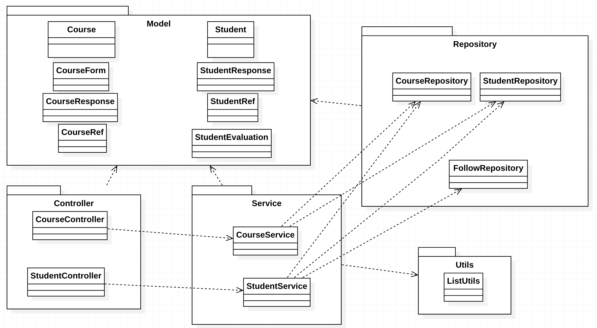

<div id="top"></div>

<br />
<div align="center">
  <a href="https://gitlab.com/yoperiquoi/imt-202111-tp-spring-periquoi/">
    
  </a>

<h1 align="center">imt-202111-tp-spring-periquoi</h3>
</div>


<!-- ABOUT THE PROJECT -->
## About The Project
<div align="center">
    
</div>

Group work : Develop an web app composed of an API REST JSON using Spring Framework

Group composed of : Matteo Ordrennea, Jules Carpio, Yoann Périquoi

<p align="right">(<a href="#top">back to top</a>)</p>


### Built With

* [Java](https://java.com/)
* [Spring](https://spring.io/)
* [Postgres](https://postgresql.org/)
* [H2](https://h2database.com/)

### Spring dependencies

* spring-boot-starter-data-jdbc
* spring-boot-starter-web
* h2
* postgresql
* spring-boot-starter-test
        


<p align="right">(<a href="#top">back to top</a>)</p>


<!-- GETTING STARTED -->
## Getting Started

The idea of the project is to use the different tools that was discovered during the Software design course about Spring Framework.
The course was teached by Romain GERVAIS for the FIL students of IMT Atlantique of the 2024 promotion.

Here the complete subject : 

Develop an web app composed of an API REST JSON using Spring Framework. 

* Use the Spring Boot framework version 2.5.X
* Use Java 11
* Use Maven
* Use “JdbcTemplate” (seen in progress) or use Spring Data JDBC (seen in progress) or if you wish, use Spring Data JPA + Hibernate (not seen in progress)
* Use an SQL database of your choice: PostgreSQL, MariaDB, etc.
* Implement automated unit/integration testing with a H2 database. Running the tests should require no other prerequisite than owning IntelliJ and Java 11. No other software, no directories outside the project, …should be required.
* Have test coverage greater than 50% line of code (to be demonstrated in defense via IntelliJ via the “Run … with Coverage” button)


Your “note entry” REST API must offer 4 features:
1. Add a course to a database as well as the students enrolled in that course. It must obviously be possible via several calls to add several courses in the application. This action must be transactional. If successful, the course and the students are recorded, in case of error during the transaction, nothing is recorded.
2. Retrieve the list of all courses from the database
3. Retrieve students with a score (“evaluation”) less than or equal to a certain value
4. Retrieve a student (via first and last name) and the courses they are enrolled in. This must obviously work with a student!

### Prerequisites

We recommand that you use an IDE like Intellij IDEA or Eclipse in order to falicitate the build of the project.

You also have to install a postgres database on your computer.
You have to create a db named 'markentry' with the username postgres and the password admin.

If you want to use your own configuration you can change the connection to your db in the application.yml according to this schema :

```yml
spring:
  datasource:
    url: jdbc:postgresql://localhost:5432/database-name
    username: username
    password: password
    driver-class-name: org.postgresql.Driver
```

### Installation

1. Clone the repo.
2. Open the project with an IDE.
3. Reload the dependencies with maven (don't forget to clean if the installation don't work).
4. Launch the app with the MarkEntryApplication class.
5. You can now start sending request to our API using your web browser or a HTTP request app.

<p align="right">(<a href="#top">back to top</a>)</p>


<!-- USAGE EXAMPLES -->
## Usage

You can now start to send requests to our api to request our api :
You can find all our request designed in postman in the conception folder :

[Postman collections for student service](conception/Student.postman_collection.json)
[Postman collections for course service](conception/Course.postman_collection.json)

Exemple of a request and a response : 

Request to find the course with the id 1 :

```HTTP
GET localhost:8080/api/course/courses/1
````

Response :
```json
{
   "courseId":1,
   "title":"Software Design",
   "description":"Design patterns and Spring framework",
   "students":[
      {
         "firstname":"Donovan",
         "lastname":"BRUN",
         "courses":[
            {
               "courseId":1
            },
            {
               "courseId":2
            }
         ],
         "new":true,
         "id":9
      },
      {
         "firstname":"Yassine",
         "lastname":"SMARA",
         "courses":[
            {
               "courseId":1
            },
            {
               "courseId":2
            }
         ],
         "new":true,
         "id":6
      },
      {
         "firstname":"Pierre",
         "lastname":"LAFON",
         "courses":[
            {
               "courseId":1
            },
            {
               "courseId":2
            }
         ],
         "new":true,
         "id":8
      },
      {
         "firstname":"Jules",
         "lastname":"CARPIO",
         "courses":[
            {
               "courseId":1
            },
            {
               "courseId":2
            }
         ],
         "new":true,
         "id":3
      },
      {
         "firstname":"Matthis",
         "lastname":"HOULES",
         "courses":[
            {
               "courseId":1
            },
            {
               "courseId":2
            }
         ],
         "new":true,
         "id":4
      },
      {
         "firstname":"Yoann",
         "lastname":"PERIQUOI",
         "courses":[
            {
               "courseId":1
            },
            {
               "courseId":2
            }
         ],
         "new":true,
         "id":1
      },
      {
         "firstname":"Thomas",
         "lastname":"HAMMON",
         "courses":[
            {
               "courseId":1
            },
            {
               "courseId":2
            }
         ],
         "new":true,
         "id":5
      },
      {
         "firstname":"Erwan",
         "lastname":"BESTARD",
         "courses":[
            {
               "courseId":1
            },
            {
               "courseId":2
            }
         ],
         "new":true,
         "id":7
      },
      {
         "firstname":"Matteo",
         "lastname":"ORDRENNEAU",
         "courses":[
            {
               "courseId":1
            },
            {
               "courseId":2
            }
         ],
         "new":true,
         "id":2
      }
   ]
}
```

<p align="right">(<a href="#top">back to top</a>)</p>

### Contact

You can contact us via our school email :
Yoann PERIQUOI : yoann.periquoi@imt-atlantique.net
Matteo ORDRENNEAU : matteo.ordrenneau@imt-atlantique.net
Jules CARPIO : jules.carpio@imt-atlantique.net

